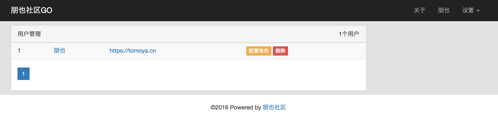
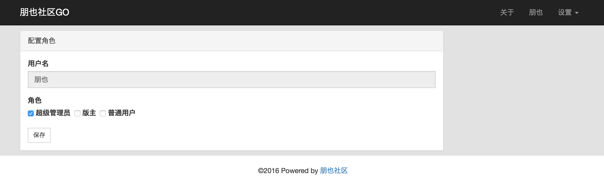
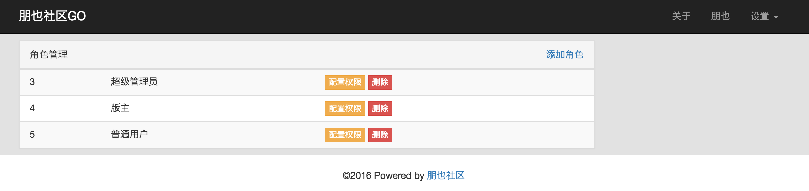
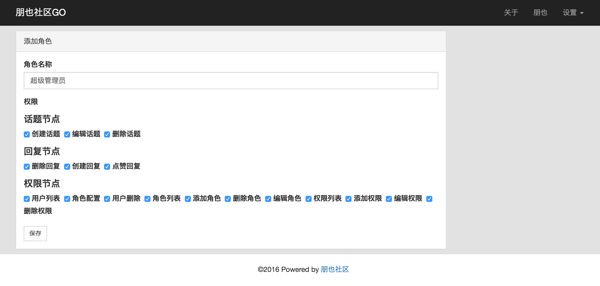
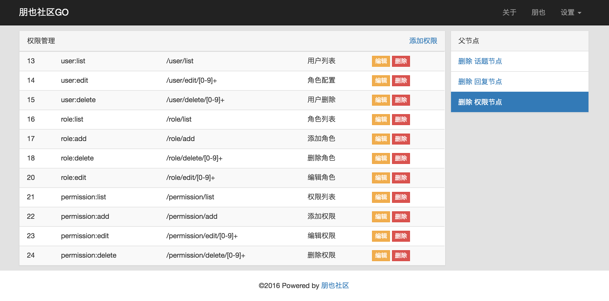

> 使用说明：请保留页面底部的 powered by 朋也社区

## 特性

- 不用session,选用cookie,为了集群方便
- 权限配置简单,轻松管理用户

## 依赖

- [github.com/astaxie/beego](https://github.com/astaxie/beego)
- [github.com/astaxie/beego/context](https://github.com/astaxie/beego/context)
- [github.com/astaxie/beego/orm](https://github.com/astaxie/beego/orm)
- [github.com/xeonx/timeago](https://github.com/xeonx/timeago)
- [github.com/russross/blackfriday](https://github.com/russross/blackfriday)
- [github.com/sluu99/uuid](https://github.com/sluu99/uuid)
- [github.com/go-sql-driver/mysql](https://github.com/go-sql-driver/mysql)
- [golang.org/x/crypto/bcrypt](https://golang.org/x/crypto/bcrypt)

## 其他版本

- Java版朋也社区: [https://github.com/atjiu/pybbs](https://github.com/atjiu/pybbs)

## 如何开始

- 克隆代码到 $GOPATH/src 下
- 安装 `govendor` 包管理器 `go get -u -v github.com/kardianos/govendor`
- 运行命令 `govendor sync` 安装依赖
- 安装 [bee](https://github.com/beego/bee) 工具
- 在mysql数据库里创建数据库名字叫pybbs-go
- 进入 pybbs-go 目录
- 修改conf/app.conf文件里的jdbc.username 和 jdbc.password
- 运行 bee run
- 将pybbs-go.sql导入数据库
- 浏览器输入 http://localhost:8080
- 登录 用户名:朋也 密码:123123 默认是超级管理员,进去了可以体验权限部分

**在执行 govendor sync 时报错**

```
Error: Remotes failed for:
        Failed for "golang.org/x/crypto/bcrypt" (failed to ping remote repo): unrecognized import path "golang.org/x/crypto/bcrypt"
        Failed for "golang.org/x/crypto/blowfish" (failed to ping remote repo): unrecognized import path "golang.org/x/crypto/blowfish"
```

解决办法如下

先手动安装一下 crypto 项目

```
cd ${GOPATH}/src/golang.org/x
git clone https://github.com/golang/crypto.git
```

然后打开项目中的 vendor 文件夹，将 vendor.json 中的 `golang.org/x/crypto/bcrypt` 和 `golang.org/x/crypto/blowfish` 两个配置项给删除即可解决


## 注意

- 如果访问地址不是localhost,需要修改conf/app.conf文件里的cookie.domain,否则登录后不会记录登录状态

## 权限部分截图







## 碰到问题怎么办?

- 到 [开发俱乐部](https://17dev.club/) 上提问答
- 在Github上提 Issue

提问题的时候请将问题重现步骤描述清楚

## 贡献

欢迎大家提pr

感谢 [@mikemouse2016](https://github.com/mikemouse2016) 的贡献，有需要装程序里的sql语句都改成orm实现的话，可以参见 [issue](https://github.com/tomoya92/pybbs-go/issues/2)

## 捐赠


请朋也喝杯茶吧

## 开源协议

MIT
